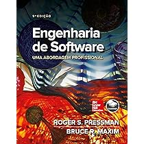
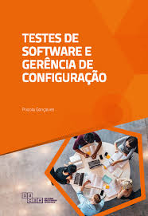
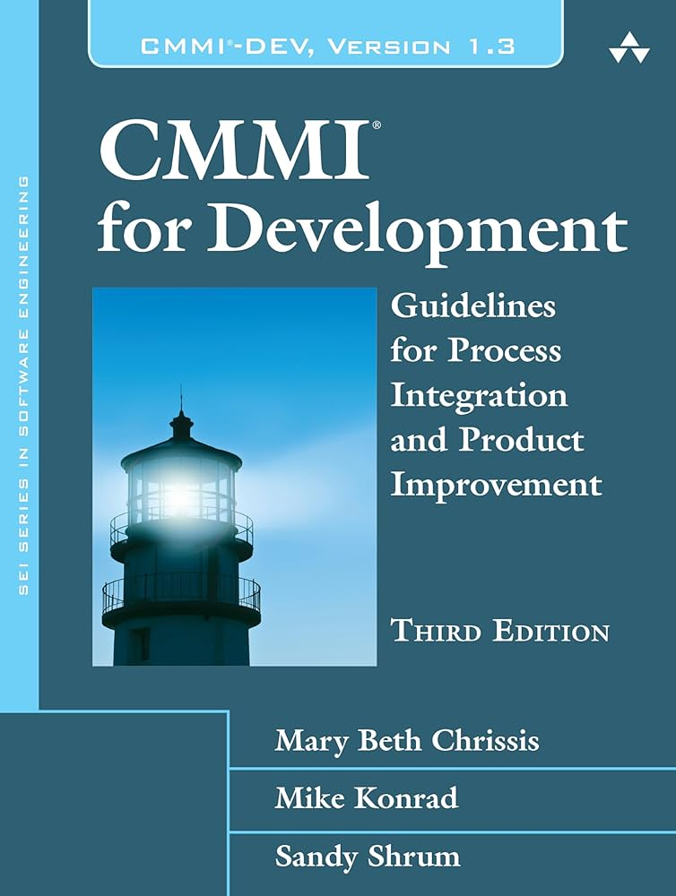
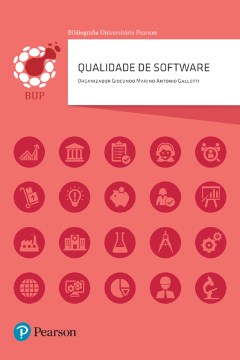
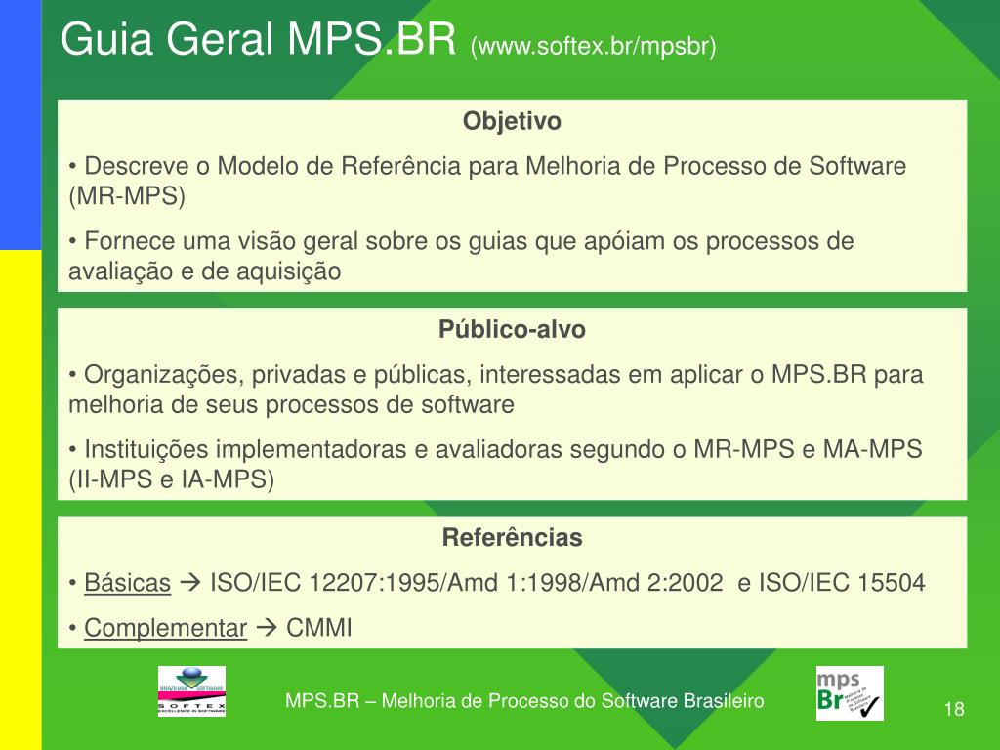
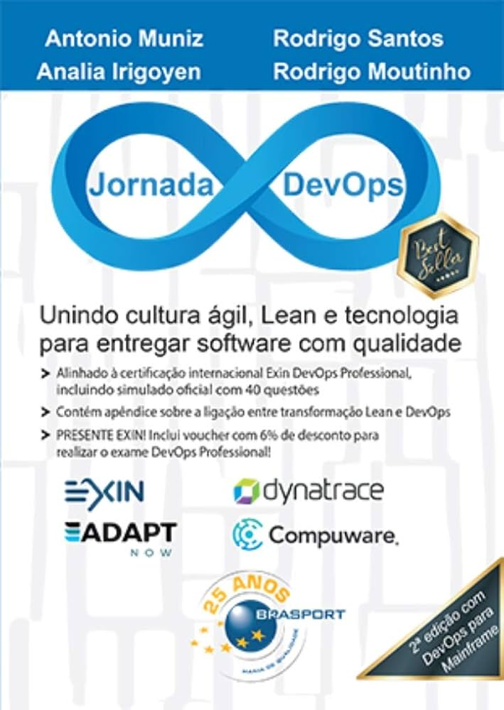
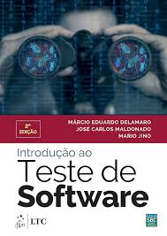

### 🏢 **Gestão e Qualidade de Software - 2025.2**

**Bem-vindo(a) à organização do GitHub dedicada à Unidade Curricular de Gestão e Qualidade de Software!** 🚀

Este espaço foi criado para disponibilizar materiais, exercícios, resoluções e exemplos práticos dos principais conceitos abordados na unidade curricular.

  
  
  
  

---

## 👩‍🏫 Professora  
**Rafaela Priscila Cruz Moreira**  
- Doutora e Mestra em Modelagem Matemática e Computacional - CEFET/MG  
- Graduada em Sistemas de Informação - UFOP/JM  
- Áreas de atuação: Desenvolvimento de sistemas, otimização, sistemas inteligentes, *machine learning*.  

📧 **Contato:** rafaela.cruz@ulife.com.br  

---

## 🎯 Objetivos da UC  
- Analisar diferentes modelos de qualidade de processos.  
- Aplicar gestão de configuração e versionamento de software.  
- Compreender a importância de **DevOps** e automação de testes.  
- Avaliar qualidade de produto (**ISO 9126**).  
- Criar estimativas de software.  
- Desenvolver e automatizar testes (unidade, integração, validação, sistemas).  
- Aplicar técnicas de **caixa preta e caixa branca**.  
- Avaliar qualidade de processo (**CMMI** e **MPS-BR**).  
- Criar testes ágeis com **TDD**.  

---

## 📚 Conteúdo da UC  

### Tópicos Geradores
1. Gestão de configuração e versionamento.  
2. Evolução de softwares legados.  
3. Qualidade de software: produto e processo.  
4. Estratégias de testes e TDD.  
5. Estimativas e indicadores de software.  
6. CMMI e MPS como medidores de maturidade.  
7. Modelos de qualidade de produto e processo.  
8. DevOps, integração contínua e automação.  
9. Análise da qualidade de software.  

---

## 🗓️ Dias e Horários  
- **Quarta-feira** → Presencial (Prof. Rafaela)  
- **Quinta-feira** → Online (Prof. Allyson)  
- **Busca ativa** → Plataforma **Ulife**  

---

## 🧪 Avaliações  

| Avaliação | Peso | Data | 2ª Chamada |
|-----------|------|------|-------------|
| **A1**   | 30 pts | 08/10 (Presencial) | 12/11 |
| **A2**   | 30 pts | 09-10/12 (Institucional) | 15/12 |
| **A3**   | 40 pts | Durante o semestre | - |

📌 **A3** = 10 pts atividades em sala (Rafaela) + 10 pts atividades em sala (Allyson) + 20 pts projeto (Rafaela).

---

✅ **Aprovação:**  
- Mínimo **70 pontos**  
- Mínimo **75% frequência**  
- Pode substituir A1 ou A2 pela **Avaliação Integradora (AI)**  (próximo semestre - presencial)

---

## 🛠 Ferramentas  
- GitHub (versionamento)  
- Jenkins/GitHub Actions (CI/CD)  
- JUnit/TestNG (testes automatizados)  
- Metodologias Ágeis  

---

## 📢 Orientações  
- Respeito sempre.  
- Faltas não são abonadas.  
- Proibido gravar/disponibilizar aulas sem autorização.  
- Plágio = **Nota ZERO**.  

---

## 💡 Dicas  
- **Pratique**: faça todas as atividades.  
- Fique atento às **datas de entrega**.  
- Resolva problemas sozinho antes de pedir ajuda.  
- Vá além do conteúdo de sala. 
- Participe de projetos sociais, hackathons, maratonas de programação e monitoria 

---

## 🚀 Extensão

- Ânima Lab Hub → [animahub.com.br](https://www.animahub.com.br)  

---

## 🚀 Tech Week 

- Tech Week → 22 a 26 de setembro  

---

## 📖 Referências Bibliográficas  

<table>
  <tr>
    <td></td>
    <td></td>
    <td></td>
    <td></td>
  </tr>
  <tr>
    <td></td>
    <td></td>
    <td></td>
    <td></td>
  </tr>
</table>

---

## ❓ Dúvidas  

Entre em contato pelo e-mail institucional.

## 🗂 Estrutura dos Repositórios

A organização será dividida em repositórios temáticos para facilitar o acesso aos conteúdos:

### 🔹 **1. Repositório: `01.Materiais-de-apoio`**
📌 Inclui apresentações e referências úteis sobre os temas abordados.

### 🔹 **2. Repositório: `02.Exemplos`**
📌 Apresenta exemplos práticos e códigos ilustrando os conceitos da abordados.

### 🔹 **3. Repositório: `03.Exercicios`**
📌 Contém listas de exercícios organizadas por tema, com desafios para reforçar os conceitos estudados e as resoluções.

### 🔹 **4. Repositório: `04.Projetos`**
📌 Projetos práticos integrando os conceitos de **qualidade de software, DevOps e testes**.

### 🔹 **5. Repositório: `05.A3-Projeto`**
📌 Projetos práticos integrando os conceitos de **qualidade de software, DevOps e testes**.

---

### 🎯 "É fazendo que se aprende a fazer aquilo que se deve aprender a fazer". Aristóteles 🚀  
